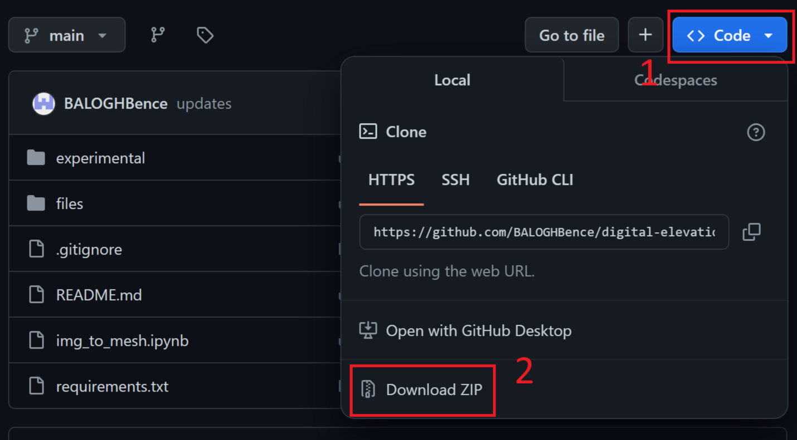
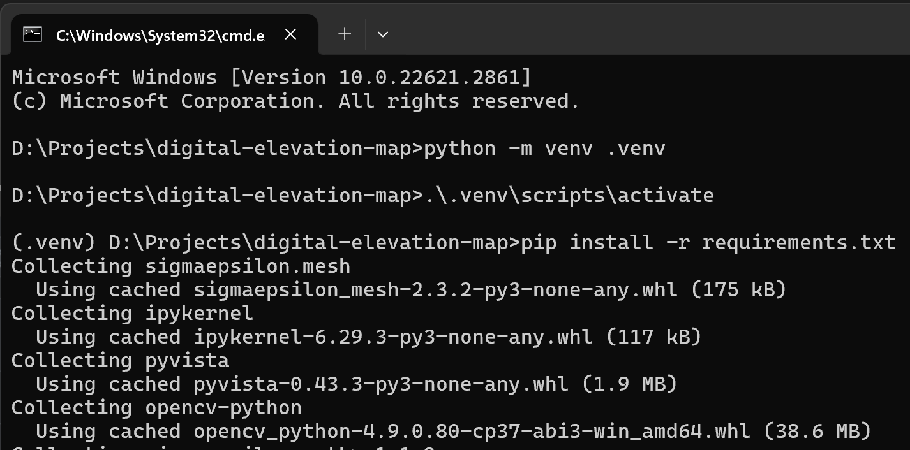

# How to make digital elevation maps in Python?

You are most probably here because you've seen the [article on Medium](https://medium.com/@bencebalogh_33809/here-is-how-to-make-digital-elevation-maps-in-python-in-a-matter-of-minutes-using-touchterrain-e0b98b66e754).

In short the notebook in the repo solves the problem of getting from here

to here


## Requirements

- Python >= 3.10
- Basic Python knowledge

## Installation

In order to run the examples you saw in the Medium article, you need to clone the repository and install the requirements locally.

```console
git clone https://github.com/BALOGHBence/digital-elevation-map.git
```

or



Then

```console
python -m venv .venv
.\.venv\scripts\activate
python -m pip install --upgrade pip
pip install -r requirements.txt
.\.venv\scripts\deactivate
```

It looks like this on Windows 10:



## Resources

- <https://opentopography.org/>
- <https://ngmdb.usgs.gov/topoview/viewer/#4/40.01/-100.06>
- <https://maps.equatorstudios.com/>
- <https://touchterrain.geol.iastate.edu/>
