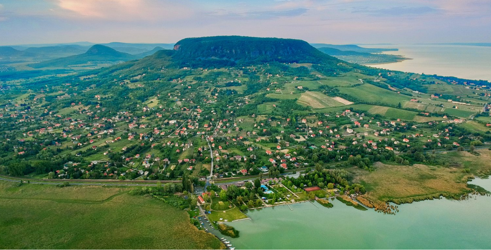
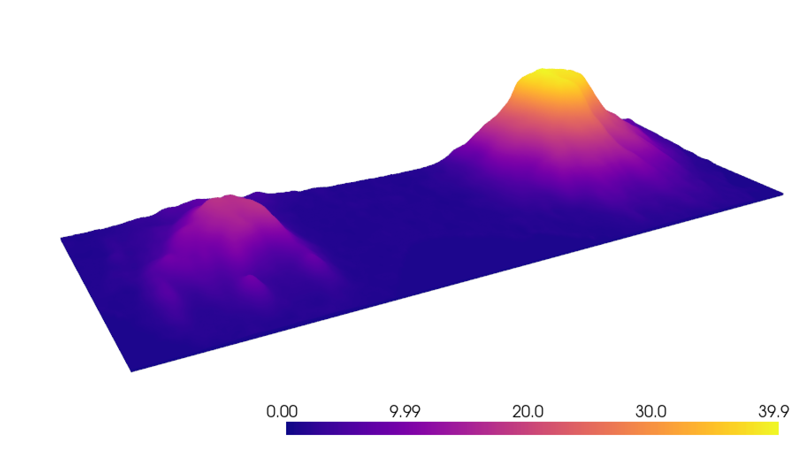

# How to make digital elevation maps in Python?




## Installation

In order to run the examples you saw in the Medium article, you need to clone the repository and install the requirements locally.

```console
python -m venv .venv
.\.venv\scripts\activate
pip install -r requirements.txt
.\.venv\scripts\deactivate
```

## Resources

- <https://opentopography.org/>
